# Deep Learning Applications — Laboratory Report

*CNNs & Residual Learning · Deep Reinforcement Learning · Transformers & the HuggingFace Ecosystem*

## Overview

This repository collects three laboratory projects exploring core areas of modern deep learning: convolutional architectures and residual learning, deep reinforcement learning with policy-gradient methods, and transfer learning / fine-tuning of pre-trained Transformers. Each lab follows an experimental, incremental methodology — building a working baseline first, then progressively testing hypotheses (depth vs. residual connections, baseline variance reduction in policy gradients, feature-extraction vs. fine-tuning) and documenting the resulting insights.

---
## Prerequisites
To be sure you can run the code in this repository run (*check the requirements.txt file before*)

`python -m venv venv`

`source venv/bin/activate`

`pip install -r requirements.txt`

If you have a GPU installed, you can also run

`pip install torch torchvision --index-url https://download.pytorch.org/whl/cu118`

---

## Lab 1 — CNNs and Residual Learning

### Motivation

The lab reproduces, at small scale, the central empirical finding of the [ResNet paper](https://arxiv.org/abs/1512.03385): beyond a certain depth, plain (non-residual) networks stop improving — and can even get *worse* — while residual networks continue to train reliably as depth increases. The experiments progress from a toy MLP/MNIST setting up to CNNs on CIFAR-10, followed by explainability via Class Activation Maps .

### Exercise 1.1 — Baseline MLP on MNIST

A two-hidden-layer MLP (with dropout) is trained for 20 epochs on MNIST, monitoring training/validation loss and validation accuracy per epoch.

<details>
<summary>Snippet MLP</summary>

```python
class MLP(nn.Module):
    """ MLP without skip connections """
    def __init__(self, input_dim, hidden_dim, output_dim, depth=2, dropout=0.0):
        super().__init__()
        # Projection of the input in the hidden_dim layer
        layers = [nn.Linear(input_dim, hidden_dim), nn.ReLU()]
        if dropout > 0:
            layers.append(nn.Dropout(dropout))

        for _ in range(depth - 1):
            layers.append(nn.Linear(hidden_dim, hidden_dim))
            layers.append(nn.ReLU())
            if dropout > 0:
                layers.append(nn.Dropout(dropout))

        layers.append(nn.Linear(hidden_dim, output_dim))
        self.network = nn.Sequential(*layers)

    def forward(self, x):
        # (batch, 1, 28, 28) -> (batch, 784)
        x = x.view(x.size(0), -1)
        return self.network(x)
```

</details>

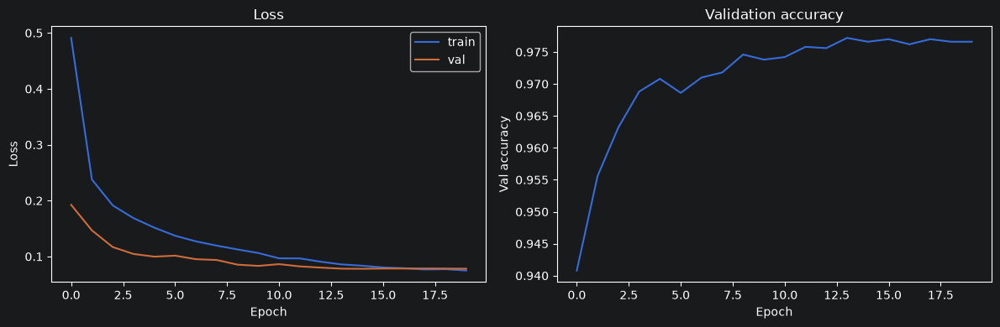

The plot shows training and validation loss converging smoothly, without a visible overfitting gap after 20 epochs, alongside a validation accuracy curve that climbs quickly and then plateaus at a high level. This confirms that MNIST is an easy enough benchmark that even a shallow, narrow MLP saturates near-ceiling performance (**97.66% validation / 97.73% test accuracy**) with no architectural sophistication required — establishing a sane baseline before the residual-connection experiments that follow.

### Exercise 1.2 — Residual Connections on MLPs

`ResidualMLP` (composed of residual blocks with skip connections) is compared against the plain `MLP` across a depth sweep (`[2, 4, 8, 12, 16]` layers), tracking both validation and test accuracy.

<details>
<summary>Snippet residual MLP</summary>

```python
class ResidualBlock(nn.Module):
    def __init__(self, dim, n_layers=2, dropout=0.0):
        super().__init__()
        layers = []
        for _ in range(n_layers):
             # dim -> dim for the skip connections
            layers.append(nn.Linear(dim, dim))
            layers.append(nn.ReLU(inplace=True))
            if dropout > 0:
                layers.append(nn.Dropout(dropout))
        self.block = nn.Sequential(*layers)

    def forward(self, x):
        # Skip connection from the input + F(x) to the output of the block
        return x + self.block(x)

class ResidualMLP(nn.Module):
    def __init__(self, input_dim, hidden_dim, output_dim, n_blocks=3, layers_per_block=2, dropout=0.0):
        super().__init__()
        self.input_layer = nn.Linear(input_dim, hidden_dim)
        # Depth n_blocks * layers_per_block layers
        self.blocks = nn.Sequential(*[
            ResidualBlock(hidden_dim, n_layers=layers_per_block, dropout=dropout)
            for _ in range(n_blocks)
        ])
        self.classifier = nn.Linear(hidden_dim, output_dim)
```

</details>

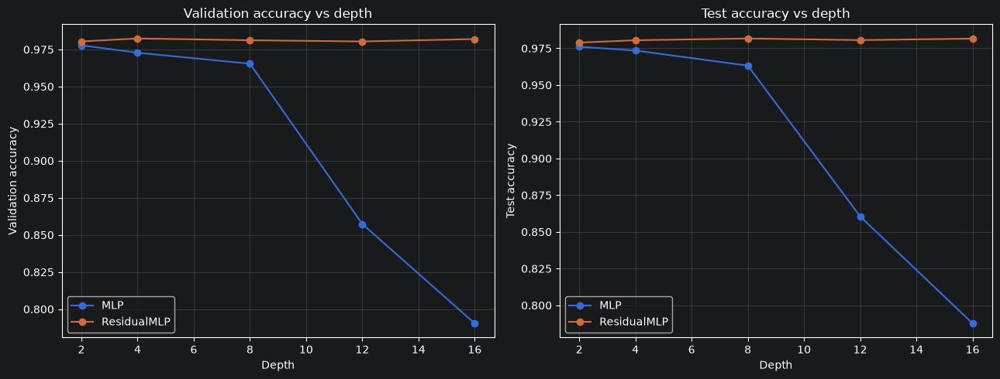

As depth increases, the plain MLP's accuracy degrades — the deepest configurations perform *worse* than shallower ones — while the ResidualMLP's accuracy stays essentially flat and high across the entire depth range. This is the core ResNet claim, reproduced directly: adding capacity without skip connections does not translate into better optimization, and can actively hurt it, whereas residual connections make depth close to "free."
<details>
<summary>Snippet gradient analysis</summary>

```python
def grad_norms_per_layer(model, x, y):
    # L2 norm of the gradients of the parameters of the model after one forward+backward
    # ona single batch
    model.zero_grad()
    out = model(x)
    loss = F.cross_entropy(out, y)
    loss.backward()
    norms = []
    for name, p in model.named_parameters():
        # Skip the 'bias' terms, evaluate just the 'weight' terms
        if 'weight' in name and p.grad is not None:
            norms.append(p.grad.norm().item())
    return norms
```

</details> 

<br />

<div style="display: flex; gap: 20px;">
    
    
</div>

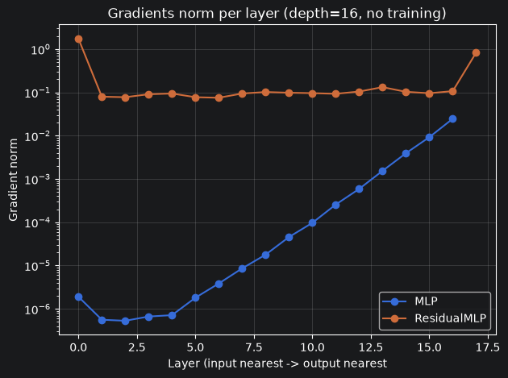

This plot inspects the gradient magnitude at each layer of the deepest (16-layer) network, on a single batch before any training. The plain MLP shows gradient norms shrinking by orders of magnitude toward the input layers (log scale) — a textbook vanishing-gradient signature — while the residual network's gradient norms stay roughly stable across layers. This is the mechanistic explanation for the accuracy gap above: the plain network's early layers barely receive a usable learning signal, while the skip connections in the residual network provide a direct gradient path that bypasses the vanishing-gradient bottleneck.

### Exercise 1.3 — From MLPs to CNNs (CIFAR-10)

The same depth-sweep methodology is repeated with `SimpleCNN` vs. a `ResidualCNN` built from torchvision's `BasicBlock`, trained on CIFAR-10 across a much deeper range (`[2, 8, 14, 20, 32, 44]` layers).

<details>
<summary>Snippet basic CNN vs ResidualCNN</summary>

```python
class ConvBlock(nn.Module):
    def __init__(self, in_channels, out_channels, stride=1):
        super().__init__()
        self.block = nn.Sequential(
             # The BatchNorm allow setting bias=False
            nn.Conv2d(in_channels, out_channels, kernel_size=3, stride=stride, padding=1, bias=False),
            nn.BatchNorm2d(out_channels),
            nn.ReLU(inplace=True),
        )

    def forward(self, x):
        return self.block(x)


class SimpleCNN(nn.Module):
    def __init__(self, in_channels=3, num_classes=10, width=64, depth=3):
        super().__init__()
        self.stem = ConvBlock(in_channels, width, stride=2)
        blocks = []
        for i in range(depth - 1):
            stride = 2 if i == 0 else 1
            blocks.append(ConvBlock(width, width, stride=stride))
        self.features = nn.Sequential(*blocks)
        
        # Global Average Pooling reduces every feature map to a scalar value,
        # in this way the number of parameters is reduced, and the network is independent
        # of the spatial size of the input image.
        self.pool = nn.AdaptiveAvgPool2d((1, 1))
        self.classifier = nn.Linear(width, num_classes)

    def forward(self, x):
        x = self.stem(x)
        x = self.features(x)
        x = self.pool(x)
        return self.classifier(torch.flatten(x, 1))


class ResidualCNN(nn.Module):
    def __init__(self, in_channels=3, num_classes=10, width=64, depth=3):
        super().__init__()
        self.stem = ConvBlock(in_channels, width, stride=2)
        blocks = []
        for i in range(depth - 1):
            if i == 0:
                downsample = nn.Sequential(
                    nn.Conv2d(width, width, kernel_size=1, stride=2, bias=False),
                    nn.BatchNorm2d(width),
                )
                blocks.append(BasicBlock(width, width, stride=2, downsample=downsample))
            else:
                blocks.append(BasicBlock(width, width))
        self.features = nn.Sequential(*blocks)
        self.pool = nn.AdaptiveAvgPool2d((1, 1))
        self.classifier = nn.Linear(width, num_classes)
```

</details>

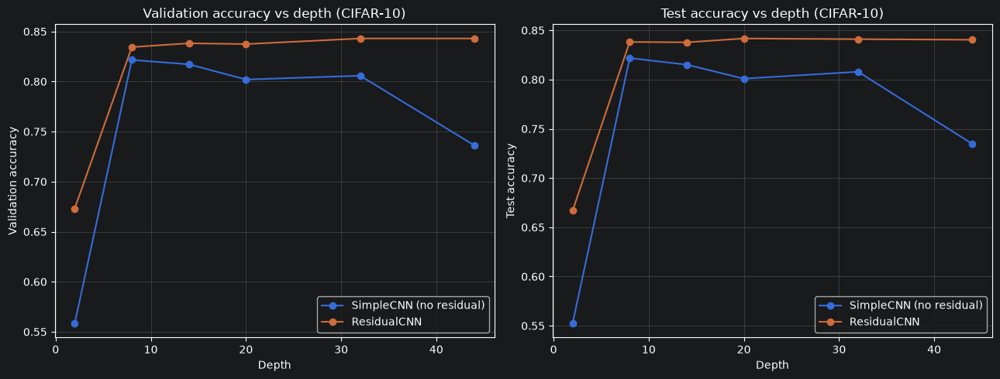

The plain `SimpleCNN` peaks at moderate depth (≈8 layers) and then *degrades* noticeably at depth 32 and 44 — the same depth-degradation problem observed on MLPs, now on a real image-classification convolutional stack. The `ResidualCNN`, in contrast, improves as depth increases up to around depth 20, after which performance plateaus rather than degrading. This is exactly the qualitative behavior reported in He et al. (2016): residual connections don't just prevent degradation, they let additional depth translate into (modest, diminishing) real accuracy gains, up to a saturation point.

### Exercise 2.3 — Explaining Predictions with Class Activation Maps (CAM)

Using the best `ResidualCNN` from Exercise 1.3, the notebook implements CAM (Zhou et al., 2016) to visualize which image regions drive each classification decision, and compares it against a pre-trained ImageNet ResNet-18 on Imagenette.
<details>
<summary>Snippet CAM</summary>

```python
def get_cam(model, feature_layer, fc_layer, img_tensor, class_idx=None, device='cpu'):
    """
    feature_layer: layer which the output is the last convolution feature map
    fc_layer: last layer (classifier)
    img_tensor: normalized image
    class_idx: class to be explained
    """
    model.eval().to(device)
    activations = {}

    def hook_fn(module, inp, out):
        activations['fmap'] = out.detach()

    # Forward hook: catch the output of feature_layer during the forward pass without changing the forward() method,
    # intercept the intermediate output layer, not the final output
    handle = feature_layer.register_forward_hook(hook_fn)
    with torch.no_grad():
        logits = model(img_tensor.unsqueeze(0).to(device))
    handle.remove() # remove hook

    if class_idx is None:
        class_idx = logits.argmax(dim=1).item()

    fmap = activations['fmap'].squeeze(0).cpu()          # (C channels, h height, w width)
    weights = fc_layer.weight[class_idx].detach().cpu()  # final weights relative to the class to explain

    C, h, w = fmap.shape
    cam = torch.zeros(h, w)
    for c in range(C):
        # Weighted sum with weight = importance of the channel given by the final classifier for the class class_idx
        cam += weights[c] * fmap[c]

    # The ReLU allow keeping only the positive value to the chosen class
    cam = F.relu(cam)
    cam = cam - cam.min()
    cam = cam / (cam.max() + 1e-8) # 0 - 1 values

    # back to original dimension
    cam = F.interpolate(cam[None, None], size=img_tensor.shape[-2:], mode='bilinear', align_corners=False)
    return cam.squeeze().numpy(), class_idx
```

</details>

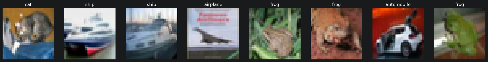

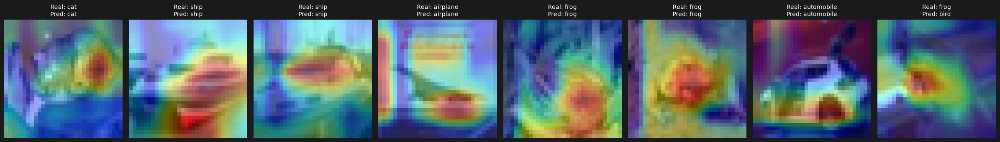

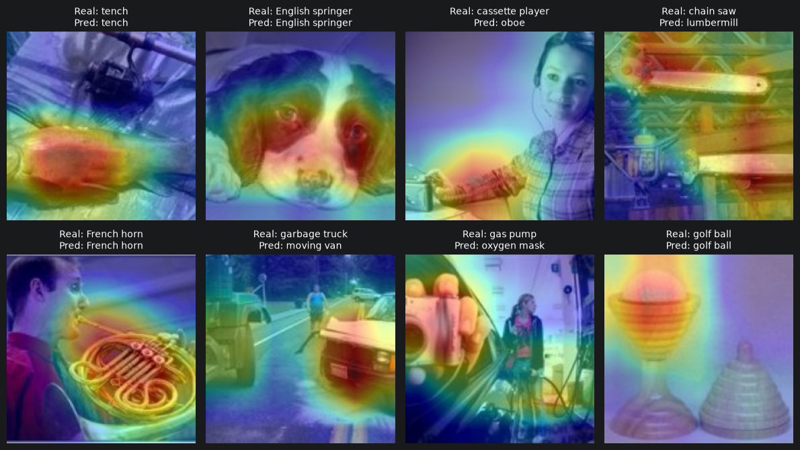

The CAM heatmaps from the pre-trained ImageNet model are sharply localized on the discriminative object regions, reflecting strong, well-formed feature representations learned from large-scale pre-training. The custom `ResidualCNN`'s CAMs are comparatively diffuse and sometimes highlight background regions, despite achieving reasonable classification accuracy — a sign that, with limited training data and capacity, the model has learned representations that are *predictive* without being as *spatially disentangled* as those of a large pre-trained model. The insight generalizes beyond this experiment: classification accuracy alone does not guarantee that a model is "looking at the right thing," which is precisely the practical value of explainability tools like CAM in a production ML pipeline (e.g., catching a model that classifies correctly for the wrong reasons, a common source of poor out-of-distribution generalization).

---

## Lab 2 — Deep Reinforcement Learning

### Motivation

The lab implements and progressively improves `REINFORCE`, the canonical policy-gradient algorithm, on the CartPole and Lunar Lander control environments from Gymnasium — investigating how variance-reduction techniques (return standardization, learned value baselines) affect training stability and sample efficiency.

### Exercise 1 — REINFORCE Baseline and Evaluation Protocol

The original implementation is refactored to periodically evaluate the agent deterministically over `M` episodes every `N` training episodes, tracking both average total reward and average episode length — a much more reliable signal than a running average of single-episode returns.

<details>
<summary>Snippet policy network and training loop REINFORCE</summary>

```python
class PolicyNet(nn.Module):
    def __init__(self, env):
        super().__init__()
        self.fc1 = nn.Linear(env.observation_space.shape[0], 128)
        self.fc2 = nn.Linear(128, env.action_space.n)

    def forward(self, s):
        s = F.relu(self.fc1(s))
        s = F.softmax(self.fc2(s), dim=-1)
        return s


class ValueNet(nn.Module):
    def __init__(self, env):
        super().__init__()
        self.fc1 = nn.Linear(env.observation_space.shape[0], 128)
        self.fc2 = nn.Linear(128, 1)

    def forward(self, s):
        s = F.relu(self.fc1(s))
        return self.fc2(s)

####

policy.train()
    for episode in range(num_episodes):
        (observations, actions, log_probs, rewards) = run_episode(env, policy, maxlen=maxlen)

        # Compute the discounted returns and update the running average of rewards
        returns = torch.tensor(compute_returns(rewards, gamma), dtype=torch.float32)
        running_rewards.append(0.05 * returns[0].item() + 0.95 * running_rewards[-1])

        # Standardize the returns
        if standardize:
            returns = (returns - returns.mean()) / (returns.std() + 1e-8)

        # Update the policy
        opt.zero_grad()
        loss = (-log_probs * returns).mean()
        loss.backward()
        opt.step()

        # Evaluate the policy every N episodes
        if episode % N == 0:
            avg_reward, avg_length = evaluate_policy(policy, env, M, maxlen)
            eval_rewards.append(avg_reward)
            eval_lengths.append(avg_length)
            print(f'Episode {episode} | Avg eval reward: {avg_reward:.1f} | Avg eval length: {avg_length:.1f}')

            if env_render:
                run_episode(env_render, policy, maxlen=maxlen)
            policy.train()
```

</details>

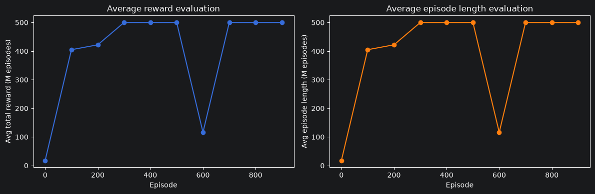

Both curves trend upward together (in CartPole, episode length and total reward are numerically identical, since the agent gets +1 reward per surviving timestep), showing the agent progressively learning to balance the pole for longer. The step-wise, periodic evaluation protocol used here removes the noise of a single-episode running average and gives a clean picture of genuine policy improvement over training.

### Exercise 2 — Variance Reduction: Standardization and Value Baselines

Two variance-reduction techniques are compared against vanilla REINFORCE: (a) standardizing returns within each episode, and (b) subtracting a learned state-value estimate `v(s)` as a baseline.

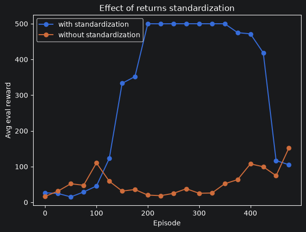

The standardized variant reach the maximum reward smoothly, while the non-standardized version shows pronounced oscillations and occasionally stalls at low reward for extended stretches. This illustrates a key practical lesson in policy-gradient methods: because the REINFORCE gradient estimator has very high variance, even a *stateless* variance-reduction trick (standardizing per-episode returns, independent of any learned baseline) can impact on training stability.

<details>
<summary>Snippet with vale baseline</summary>

```python
    for episode in range(num_episodes):
        (observations, actions, log_probs, rewards) = run_episode(env, policy, maxlen=maxlen)

        returns = torch.tensor(compute_returns(rewards, gamma), dtype=torch.float32)
        running_rewards.append(0.05 * returns[0].item() + 0.95 * running_rewards[-1])

        obs_batch = torch.stack(observations).float()
        values = value_net(obs_batch).squeeze(-1)

        # Compute advantages: compute the difference between the returns and the value estimates,
        # so how much better or worse the actual return was compared to what the value network predicted.
        # .detach() so the gradient of the policy loss does not flow into the value network.
        advantages = returns - values.detach()
        advantages = (advantages - advantages.mean()) / (advantages.std() + 1e-8)

        # Compute the policy loss and value loss
        policy_loss = (-log_probs * advantages).mean()
        value_loss = value_loss_fn(values, returns)

        # Update the policy and value networks
        policy_opt.zero_grad()
        policy_loss.backward()
        torch.nn.utils.clip_grad_norm_(policy.parameters(), 1.0)
        policy_opt.step()

        # Update the value network
        value_opt.zero_grad()
        value_loss.backward()
        torch.nn.utils.clip_grad_norm_(value_net.parameters(), 1.0)
        value_opt.step()

        # Evaluate the policy every N episodes
        if episode % N == 0:
            avg_reward, avg_length = evaluate_policy(policy, env, M, maxlen)
            eval_rewards.append(avg_reward)
            eval_lengths.append(avg_length)
            print(f'Episode {episode} | Avg eval reward: {avg_reward:.1f} | Avg eval length: {avg_length:.1f}')
            if env_render:
                run_episode(env_render, policy, maxlen=maxlen)
            policy.train()
```

</details>

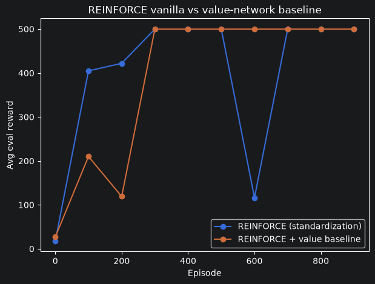

Adding a learned value-network baseline further improves convergence speed and stability relative to standardization alone, reaching high average reward earlier and with fewer sharp performance drops. Because the value baseline is *state-dependent* (unlike the constant per-episode standardization), it credits each action according to how much better or worse the outcome was than what was already expected from that specific state.

### Exercise 3.1 — Scaling Up: Lunar Lander

The same `REINFORCE + value baseline` combination is applied unmodified to the harder Lunar Lander environment (8-dimensional observations, 4 discrete actions), relying on `PolicyNet`/`ValueNet` reading their input/output dimensions directly from the environment.

<details>
<summary>Snippet Lunar Lander</summary>

```python
env_lunar = gym.make('LunarLander-v3')
env_lunar.reset(seed=seed)
print("Observation space:", env_lunar.observation_space)
print("Action space:", env_lunar.action_space)

policy_lunar = PolicyNet(env_lunar)
value_net_lunar = ValueNet(env_lunar)

running_rewards_lunar, eval_rewards_lunar, eval_lengths_lunar = reinforce_baseline(
    policy_lunar, value_net_lunar, env_lunar,
    gamma=0.99, num_episodes=4000, N=100, M=30, lr=1e-3, maxlen=1000
)
```

</details>

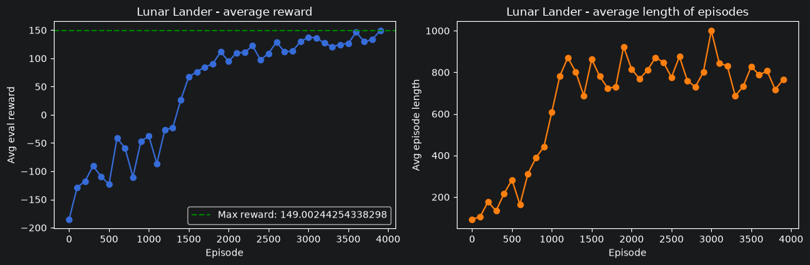

Unlike CartPole, reward and episode length are no longer numerically coupled (Lunar Lander penalizes crashes and rewards a controlled landing, independent of episode duration), so the two curves diverge — a longer episode is not automatically a better one. This exercise demonstrates the main practical advantage of the modular design built in Exercise 1: swapping to a substantially harder environment required no changes to the policy, value network, or training loop, only a different `gym.make(...)` call.

---

## Lab 3 — Transformers in the HuggingFace Ecosystem

### Motivation

The lab builds a sentiment-analysis pipeline on the Cornell Rotten Tomatoes dataset around DistilBERT, comparing a **frozen feature-extraction + classical classifier** baseline against **end-to-end fine-tuning**, and closes with a creative extension chaining an image-captioning model into the fine-tuned sentiment classifier.

### Exercise 1.3 — Frozen DistilBERT + Linear SVM (Stable Baseline)

`[CLS]` token embeddings from a frozen, pre-trained DistilBERT are extracted for every split and fed into a `LinearSVC`.

<details>
<summary>Snippet DistilBERT</summary>

```python
def extract_cls_embeddings(texts, batch_size=32):
    all_embeddings = []

    for i in range(0, len(texts), batch_size):
        batch_texts = texts[i:i + batch_size]
        encoded = tokenizer(
            batch_texts,
            padding=True,
            truncation=True,
            return_tensors="pt"
        ).to(device)

        with torch.no_grad():
            outputs = model(**encoded)
        # Same trick as before
        cls_embeddings = outputs.last_hidden_state[:, 0, :].cpu().numpy()
        all_embeddings.append(cls_embeddings)

    return np.concatenate(all_embeddings, axis=0)

### Evaluation

# Train classifier, LinearSVC on frozen features, it shows how good DistilBERT's pretrained representations already are
clf = LinearSVC()
clf.fit(X_train, y_train)

# Evaluate
val_pred = clf.predict(X_val)
test_pred = clf.predict(X_test)

baseline_val_acc = accuracy_score(y_val, val_pred)
baseline_test_acc = accuracy_score(y_test, test_pred)
```

</details>


The baseline reaches **82.2% validation accuracy and 79.8% test accuracy**, with balanced precision and recall across both sentiment classes. Because DistilBERT's weights are entirely frozen here, this result is a direct measure of how *generically useful* — without any task-specific adaptation — the pre-trained representation already is for sentiment classification. It anchors the fine-tuning experiment that follows: any improvement over ~80% test accuracy can be attributed specifically to task-adapted fine-tuning, not to the base representation quality.

### Exercise 2.3 — Fine-tuning DistilBERT End-to-End

A `AutoModelForSequenceClassification` head is trained end-to-end with the HuggingFace `Trainer` API for 3 epochs, tracking accuracy, precision, recall, and F1 at each epoch, with the best checkpoint selected by validation F1.

<details>
<summary>Snippet fine-tuning DistilBERT</summary>

```python
def evaluation_funct(eval_pred):
    logits, labels = eval_pred
    preds = np.argmax(logits, axis=-1)
    acc = accuracy_score(labels, preds)
    p, r, f1, _ = precision_recall_fscore_support(labels, preds, average="binary", zero_division=0)
    return {
        "accuracy": acc,
        "precision": p,
        "recall": r,
        "f1": f1
    }

# 3. Training arguments
training_args = TrainingArguments(
    output_dir="distilbert-rotten-tomatoes-finetune",
    eval_strategy="epoch", # evaluate at the end of every epoch
    save_strategy="epoch",
    learning_rate=2e-5, # standard fine-tuning LR for BERT-family models
    per_device_train_batch_size=16,
    per_device_eval_batch_size=32,
    num_train_epochs=3,
    weight_decay=0.01,
    logging_steps=100,
    # To avoid saving an overfitted model
    load_best_model_at_end=True,
    metric_for_best_model="f1",
    greater_is_better=True,
    fp16=torch.cuda.is_available(), # use mixed precision only if a GPU is
)

# 4. Trainer
trainer = Trainer(
    model=model,
    args=training_args,
    train_dataset=train_dataset,
    eval_dataset=eval_dataset,
    processing_class=tokenizer,
    data_collator=data_collator,
    compute_metrics=evaluation_funct,
)

# 5. Train
train_result = trainer.train()
trainer.save_model(training_args.output_dir)

eval_metrics = trainer.evaluate(eval_dataset=eval_dataset)
```

</details>

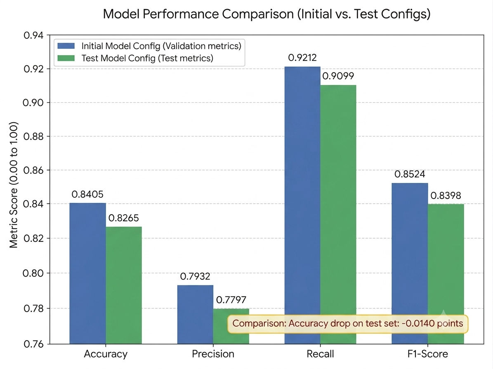

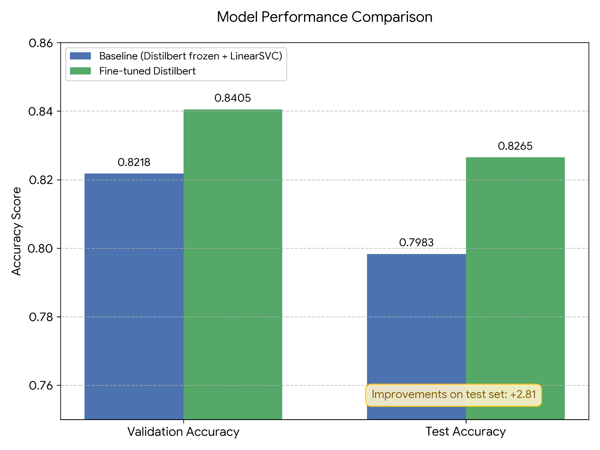

Fine-tuning improves test accuracy from 79.8% to **82.6% (+2.8 points)** over the frozen baseline, confirming that allowing the representation itself to adapt to the sentiment task yields a real, measurable gain beyond what a frozen feature extractor can provide. The best checkpoint is selected after epoch 1: from epoch 2 onward, validation loss increases while training loss keeps falling — a clear overfitting signature on a comparatively small dataset (≈8.5k training examples). The fine-tuned model also shows a recall/precision imbalance on the positive class (0.91 recall vs. 0.78 precision) that the frozen baseline did not exhibit, indicating a learned bias toward predicting "positive" — a useful diagnostic for anyone deploying this model, since it implies the decision threshold or class weighting may need calibration for applications sensitive to false positives.

### Exercise 3.3 — Creative Extension: Meme Sentiment via Captioning

A two-model pipeline is built: BLIP generates a natural-language caption for a meme image, and the fine-tuned DistilBERT sentiment classifier scores that caption as positive/negative.

<details>
<summary>Snippet two pre-trained pipelines</summary>

```python
# Import dataset meme
meme_ds = load_dataset("Ahren09/MMSoc_Memotion", split="train")
meme_ds_shuffled = meme_ds.shuffle(seed=random.randint(0, 10_000))

n_samples = 8
sample_images = [meme_ds_shuffled[i]["image"] for i in range(n_samples)]
print(sample_images)

# 1. Loading the image captioning model
caption_processor = BlipProcessor.from_pretrained("Salesforce/blip-image-captioning-base")
caption_model = BlipForConditionalGeneration.from_pretrained("Salesforce/blip-image-captioning-base").to(device)

def generate_caption(image: Image.Image) -> str:
    inputs = caption_processor(image, return_tensors="pt").to(device)
    out = caption_model.generate(**inputs, max_new_tokens=30)
    return caption_processor.decode(out[0], skip_special_tokens=True)

# 2. Loading sentiment classification from exercise 2.3, the FINE-TUNED checkpoint saved
sentiment_pipe = pipeline(
    "sentiment-analysis",
    model=training_args.output_dir,
    device= device,
)

# 3. Function: meme -> caption -> sentiment
def analyze_meme(image: Image.Image):
    caption = generate_caption(image)
    sentiment = sentiment_pipe(caption)[0]
    return caption, sentiment

def show_meme_analysis(image: Image.Image):
    caption, sentiment = analyze_meme(image)
    plt.figure(figsize=(5, 5))
    plt.imshow(image)
    plt.axis("off")
    plt.title(f'"{caption}"\n{sentiment["label"]} ({sentiment["score"]:.2f})', fontsize=11)
    plt.show()
    return caption, sentiment

for img in sample_images:
    caption, sentiment = show_meme_analysis(img)
    print(f"Caption: {caption}")
    print(f"Sentiment: {sentiment}")
    print("---")
```

</details>

<br />

<div style="display: flex; gap: 20px;">
    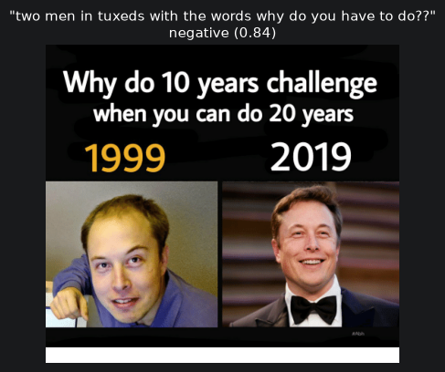
    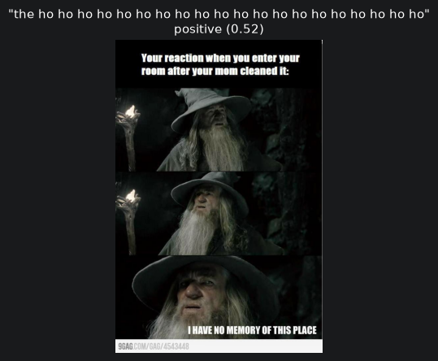
</div>

<div style="display: flex; gap: 20px;">
    
    
</div>

The qualitative results expose the central limitation of chaining two independently-trained, single-modality models: the sentiment classifier operates purely on the *literal* caption text, with no access to the image's visual tone, irony, or meme-culture context. Captions that are semantically coherent are classified sensibly, but captions that are degenerate (e.g., repeated tokens from a captioning failure) or that rely on ironic/sarcastic framing common in meme culture are frequently misclassified, since the sentiment model was fine-tuned on straightforward movie-review prose, not on internet humor. This is a useful, low-cost illustration of a broader lesson in multimodal ML system design: composing single-modality models post-hoc is a reasonable prototyping strategy, but it caps the ceiling of what the system can understand at whatever the weakest link (here, caption quality and lack of true multimodal grounding) allows.

---

## Key Takeaways

1. **Depth is not free without residual connections.** Across both MLPs (MNIST) and CNNs (CIFAR-10), plain architectures degrade past a certain depth due to vanishing gradients, while residual architectures remain trainable and continue to (mildly) benefit from additional depth up to a saturation point — a clean, small-scale reproduction of the central ResNet finding.
2. **Variance reduction is not optional in policy-gradient RL.** Both a stateless trick (return standardization) and a learned, state-dependent baseline (value network) produce large, visible improvements in REINFORCE's training stability and sample efficiency on CartPole; the modularity of the implementation allowed the same recipe to transfer to the harder Lunar Lander task with zero code changes.
3. **Fine-tuning beats frozen feature extraction, but overfits fast on small datasets.** DistilBERT fine-tuning improved test accuracy by ~3 points over a frozen-feature SVM baseline, but validation performance peaked after a single epoch on the ~8.5k-example Rotten Tomatoes training set, underscoring the importance of early stopping / checkpoint selection even for "small" fine-tuning jobs.
4. **Accuracy and explainability are different axes.** CAM visualizations showed that a custom, moderately-accurate CNN can produce far less spatially-grounded attention than a large pre-trained model — a reminder that benchmark accuracy alone does not certify that a model has learned the "right" features.

## References

- He, K., Zhang, X., Ren, S., & Sun, J. (2016). *Deep Residual Learning for Image Recognition*. CVPR. [arXiv:1512.03385](https://arxiv.org/abs/1512.03385)
- Hinton, G., Vinyals, O., & Dean, J. (2015). *Distilling the Knowledge in a Neural Network*. NeurIPS. [arXiv:1503.02531](https://arxiv.org/abs/1503.02531)
- Zhou, B., Khosla, A., Lapedriza, A., Oliva, A., & Torralba, A. (2016). *Learning Deep Features for Discriminative Localization*. CVPR.
- Sanh, V., et al. (2019). *DistilBERT, a distilled version of BERT*. [DistilBERT model card](https://huggingface.co/distilbert/distilbert-base-uncased)
- Cornell Movie Review Data — [Rotten Tomatoes dataset](https://huggingface.co/datasets/cornell-movie-review-data/rotten_tomatoes)
- Gymnasium - https://gymnasium.farama.org/
